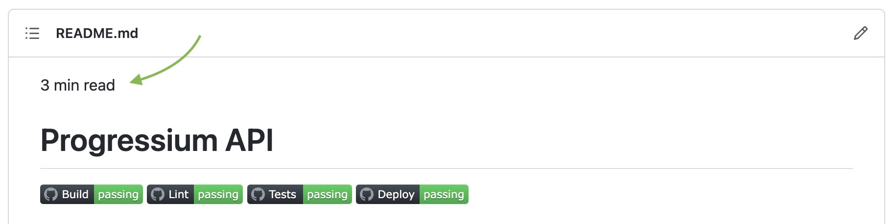
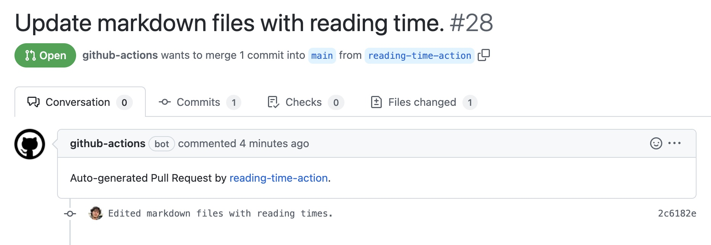

<p id="reading-time-action-id" align="left">2 min read</p>

# GitHub Action to Calculate & Insert Reading Time

<a href="https://github.com/harunrst/reading-time-action/actions"></a>

Reading time action calculates medium-like reading times of markdown files in your repository and inserts them to the top of your markdown files.



Moreover;

- Pick your calculation strategy: only readme file, specific paths, and all markdown files.
- Pick your style: regular/bold text, align it to left/center/right.
- Merge and run as you wish;
  - Run on push / manually: get auto-generated PR to your markdown files or push to your branch.
  - Run on pull-request: update your pull request with calculated times.
  - Or do whatever you wish to do with the updated markdowns :)

## Usage

All examples below are triggered only when you make a change on a markdown file. To trigger for the first time, I suggest you run manually using `workflow_dispatch`

### Example Workflow File

Updates readme and works on push / manually and creates pull-request. On push triggers only if there is a change on readme file.

```yaml
name: Reading Time

on:
  workflow_dispatch:
  push:
    branches:
      - main
    paths:
      - '**.md'

jobs:
  calculate-reading-time:
    runs-on: ubuntu-latest
    name: Calculate Reading Time
    permissions:
      contents: write
      pull-requests: write
    steps:
      - name: Checkout
        uses: actions/checkout@v3

      - name: Calculate & Prepend Reading Time
        uses: harunrst/reading-time-action@v1.0
        with:
          strategy: readme
          text-style: default

      # Example with paths strategy
      # - name: Calculate & Prepend Reading Time
      #   uses: harunrst/reading-time-action@v1.0
      #   with:
      #     strategy: paths
      #     paths: docs|files
      #     text-style: default

      - name: Commit Changes
        uses: EndBug/add-and-commit@v9
        with:
          message: Edited markdown files with reading times.
          push: false

      # !! Allow GitHub Actions to create pull-request from settings in your repository
      - name: Create Pull Request
        uses: peter-evans/create-pull-request@v4
        with:
          title: Update markdown files with reading time.
          body: Auto-generated Pull Request by [reading-time-action](https://github.com/harunrst/reading-time-action).
          branch: reading-time-action

      # Example Push Changes
      # - name: Push changes
      #   uses: ad-m/github-push-action@master
      #   with:
      #     github_token: ${{ secrets.GITHUB_TOKEN }}
      #     branch: ${{ github.ref }}
```



### Example Repositories

- [Progressium-API](https://github.com/harunrst/Progressium-Api)

- [Essentials-of-Being-a-Software-Engineer](https://github.com/harunrst/Essentials-of-Being-a-Software-Engineer)

- [github-books-template](https://github.com/harunrst/github-books-template)
